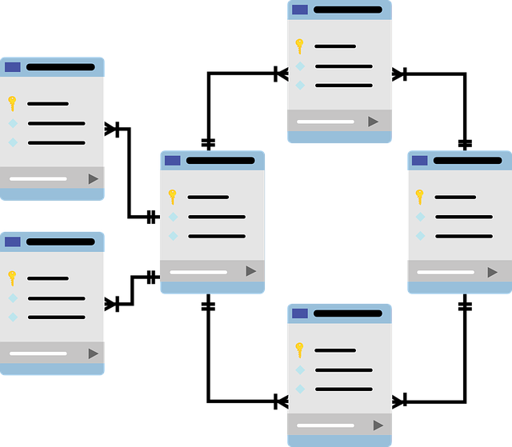

# Feltex

Este é um projeto que visa o aprendizado do Docker e Docker Compose.

Assista também nossos vídeos no youtube [Canal no youtube](https://www.youtube.com/channel/UCO0bQoHp9v8LLGyNU1Q0ctQ)

Projeto com os comandos mais immportantes sobre Docker.

Aprenda com vários exemplos de utilização do Docker.

* Nginx
* MySQL
* PostgreSQL
* MongoDB
